# Architecture: Vercel + Redis + Node.js Worker

When integrating a cloud-based Vercel backend with a local GPU-accelerated computing environment, you need a message broker (Redis) and a worker process (Node.js) to bridge the two networks.

## Architecture Diagram

```mermaid
sequenceDiagram
    autonumber
    
    actor User as Client (Browser/React)
    participant Vercel as Vercel Backend (Node.js)
    participant Cloud_Redis as Cloud Redis (Upstash / Railway)
    participant Local_Worker as Local Node Worker (Docker Win10)
    participant Local_KataGo as Local KataGo (Docker Win10 GPU)
    
    rect rgb(20, 30, 80)
    note right of Vercel: Cloud Environment
    User->>Vercel: POST /analyze
    Vercel->>Cloud_Redis: Bull Queue: add(job)
    Vercel-->>User: HTTP 202 Accepted (Job ID)
    end
    
    rect rgb(40, 20, 40)
    note right of Local_Worker: Windows 10 Local Environment
    loop Poll
        Local_Worker->>Cloud_Redis: Bull Queue: process()
    end
    
    Cloud_Redis-->>Local_Worker: Deliver Job
    Local_Worker->>Local_KataGo: HTTP POST localhost:8080/analyze
    Local_KataGo-->>Local_Worker: Return Analysis JSON
    
    Local_Worker->>Cloud_Redis: Bull Queue: Update Job Status (Done + Data)
    end
    
    loop Polling Status
        User->>Vercel: GET /job/:id
        Vercel->>Cloud_Redis: Check Job Result
        Cloud_Redis-->>Vercel: Output JSON
        Vercel-->>User: Final Result
    end
```

## How they coexist

1.  **Vercel Backend (Cloud)**: This is stateless and serverless. It receives HTTP requests from your frontend and simply pushes a "Job" payload to a **Cloud Redis** instance (like Upstash, Railway, or standard Redis exposed to the internet). It cannot easily communicate directly with your Windows 10 machine since your machine is typically behind a NAT/Router.
2.  **Redis (The Broker)**: For this pipeline to work smoothly, both Vercel and your Local Windows 10 Worker need to talk to the **exact same Redis instance**. 
    *   **Option A**: Run Redis on your Windows 10 Docker (like your newly created `katago-redis`), and expose port 6379 to the public internet using a tool like `ngrok`, `frp`, or port forwarding on your router, then give that IP to Vercel. 
    *   **Option B (Recommended)**: Use a free Cloud Redis service (e.g., Upstash). Tell your Vercel backend and your Windows 10 worker to both connect to that cloud Redis URL. You can still run a local Redis container for *local* development/testing.
3.  **Local Node.js Worker (Docker)**: Runs continuously on Windows 10 in a container. It connects to the Redis Queue (Bull) and listens for new jobs. When it pops a job, it makes an HTTP request to the KataGo Container (which is also running on the same Windows 10 Docker). After KataGo responds, the Worker updates the job result in Redis.
